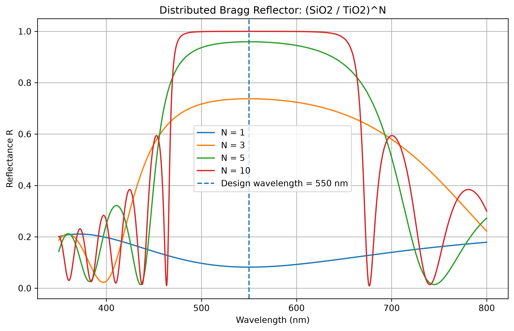
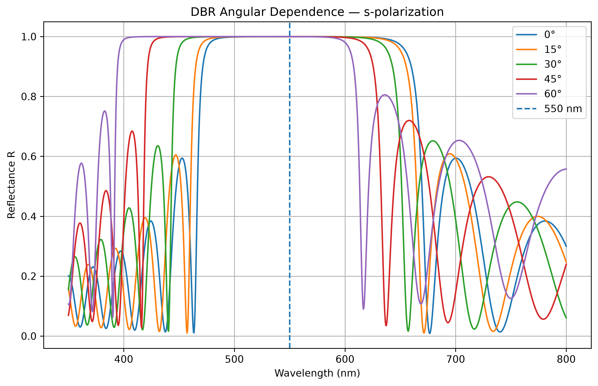
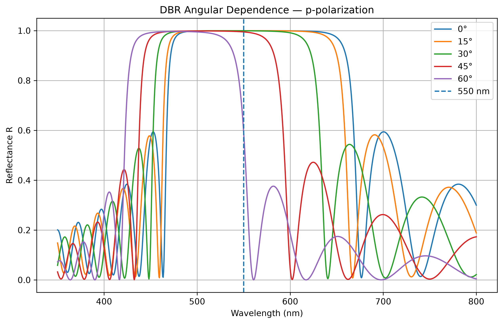
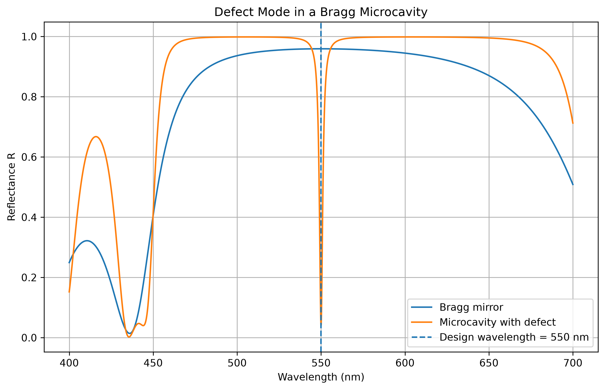

# Multilayer Optics

Numerical simulation of light reflection from optical interfaces and multilayer dielectric structures using Python and the Transfer Matrix Method (TMM).

The project studies Fresnel reflection, polarization effects, total internal reflection, thin-film interference, dielectric Bragg reflectors and optical microcavities.

## Project Goals

The main goals of this project are:

- study Fresnel reflection at dielectric interfaces;
- investigate s- and p-polarization;
- calculate the Brewster and critical angles;
- model multilayer dielectric structures using the Transfer Matrix Method;
- investigate the influence of material and layer thickness;
- design a dielectric Bragg reflector;
- investigate angular and polarization dependence of a Bragg mirror;
- model a defect mode in an optical microcavity.

## Physical Background

### Fresnel Reflection

When light reaches an interface between two media, part of the electromagnetic wave is reflected and part is transmitted.

The reflection depends on:

- refractive indices;
- angle of incidence;
- polarization.

The project calculates the reflectance

\[
R = |r|^2
\]

separately for s- and p-polarized light.

For p-polarization, the reflection becomes zero at the Brewster angle:

\[
\tan \theta_B = \frac{n_2}{n_1}.
\]

### Total Internal Reflection

When light propagates from a medium with a larger refractive index to a medium with a smaller refractive index, total internal reflection can occur.

The critical angle satisfies

\[
\sin\theta_c = \frac{n_2}{n_1}.
\]

For angles larger than the critical angle,

\[
R = 1.
\]

### Transfer Matrix Method

Multilayer structures are calculated using the Transfer Matrix Method.

Each optical layer is represented by a characteristic matrix

\[
M_i =
\begin{pmatrix}
\cos\delta_i & \frac{i\sin\delta_i}{\eta_i}\\
i\eta_i\sin\delta_i & \cos\delta_i
\end{pmatrix}.
\]

The phase thickness is

\[
\delta_i =
\frac{2\pi}{\lambda}
n_i d_i \cos\theta_i.
\]

The matrix of the complete optical structure is obtained by multiplying the matrices of all layers:

\[
M = M_1M_2M_3\dots M_N.
\]

This makes it possible to calculate the reflection spectrum of complex multilayer structures.

## Dielectric Bragg Reflector

A dielectric Bragg reflector was constructed using alternating SiO2 and TiO2 layers:

\[
(SiO_2/TiO_2)^N.
\]

The design wavelength was

\[
\lambda_0 = 550\text{ nm}.
\]

Quarter-wave layer thicknesses were used:

\[
d = \frac{\lambda_0}{4n}.
\]

For the parameters used in this project:

- SiO2: approximately 94.18 nm
- TiO2: approximately 57.29 nm

Increasing the number of layer pairs produces a broad region of high reflectance called the photonic stop band.



## Angular Dependence

The Bragg reflector was also studied at different incidence angles:

- 0°
- 15°
- 30°
- 45°
- 60°

As the incidence angle increases, the reflection band shifts toward shorter wavelengths.

The behavior is different for s- and p-polarized light.

### s-polarization



### p-polarization



## Optical Microcavity

A defect layer was inserted between two Bragg reflectors.

The structure has the form

\[
(SiO_2/TiO_2)^5
|
\text{Defect}
|
(TiO_2/SiO_2)^5.
\]

The defect creates a localized optical mode inside the photonic stop band.

A narrow dip in reflectance appears close to the design wavelength of 550 nm.



This demonstrates the formation of a resonant mode inside a multilayer dielectric structure.

## Other Simulations

The project also includes:

### Fresnel reflection


### Material comparison


### Total internal reflection


### Layer comparison


### Thickness optimization


## Project Structure

```text
multilayer_optics/
│
├── figures/
│   ├── fresnel_reflection.png
│   ├── material_comparison.png
│   ├── total_internal_reflection.png
│   ├── layer_comparison.png
│   ├── thickness_optimization.png
│   ├── bragg_mirror.png
│   ├── angular_dependence_s.png
│   ├── angular_dependence_p.png
│   └── microcavity.png
│
├── fresnel_reflection.py
├── material_comparison.py
├── total_internal_reflection.py
├── multilayer_tmm.py
├── layer_comparison.py
├── thickness_optimization.py
├── bragg_mirror.py
├── angular_dependence.py
├── microcavity.py
├── requirements.txt
└── README.md
```

## Requirements

The project uses:

- Python
- NumPy
- Matplotlib

Install the dependencies with:

```bash
pip install -r requirements.txt
```

## Main Results

The numerical simulations demonstrate that:

1. Fresnel reflection strongly depends on incidence angle and polarization.
2. p-polarized light has zero reflection at the Brewster angle.
3. Total internal reflection occurs above the critical angle.
4. Thin dielectric layers produce interference effects.
5. Alternating dielectric layers can create a high-reflectance Bragg mirror.
6. Increasing the number of layer pairs increases the reflectance of the stop band.
7. The stop band shifts when the angle of incidence changes.
8. s- and p-polarized waves behave differently at oblique incidence.
9. A defect inside a Bragg structure creates a narrow resonant mode inside the stop band.

## Applications

The physical principles studied in this project are used in:

- dielectric mirrors;
- optical filters;
- laser resonators;
- anti-reflection coatings;
- photonic crystals;
- optical sensors;
- microcavities;
- wavelength-selective optical devices.

## Author

Physics student project.

Peter the Great St. Petersburg Polytechnic University (SPbPU).