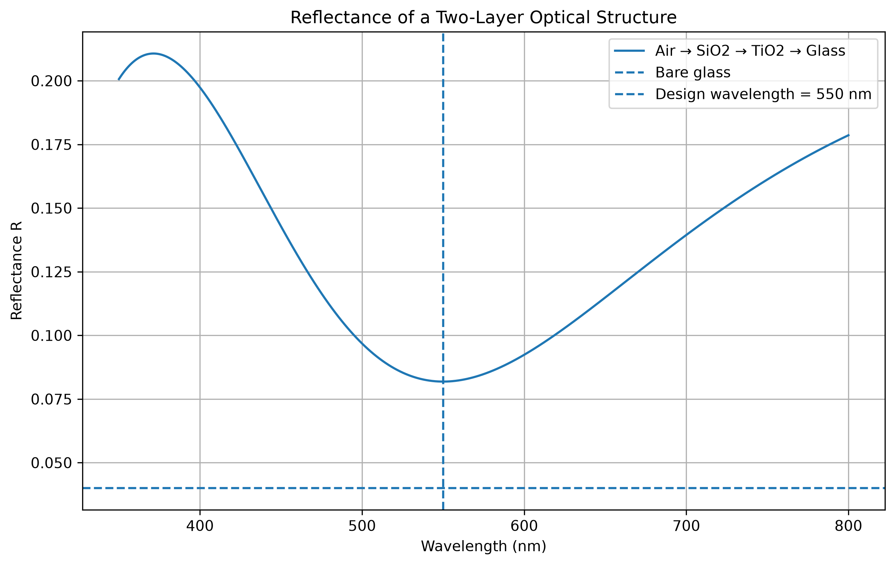
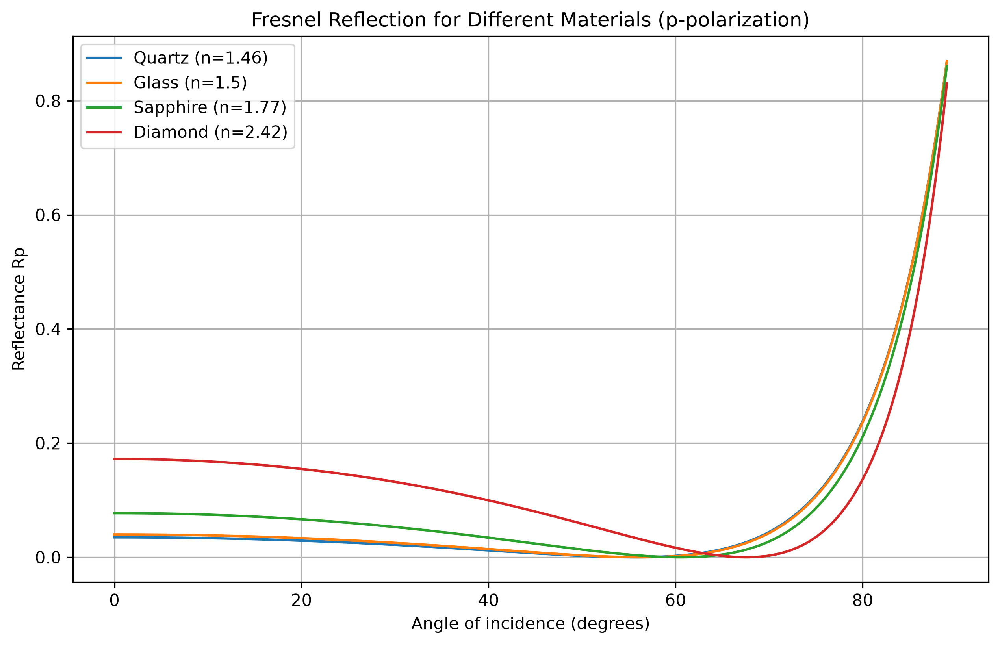
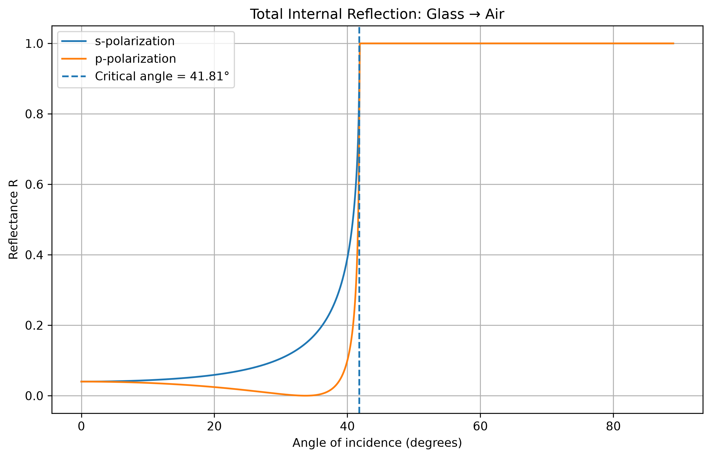
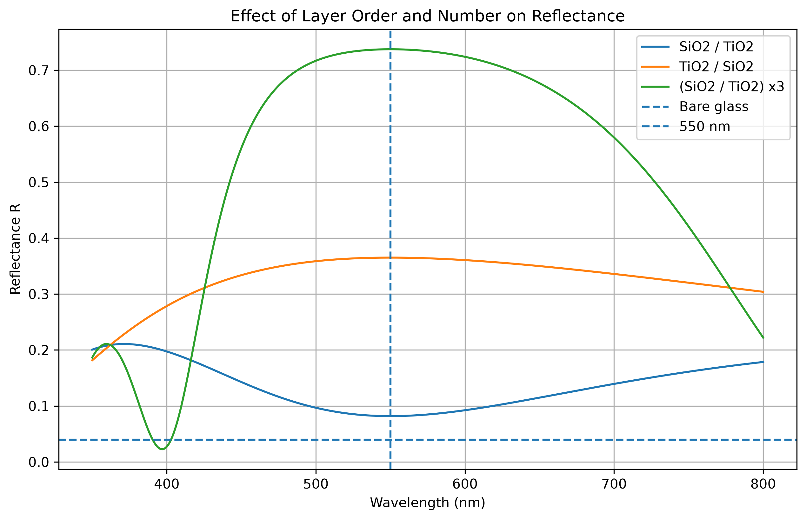
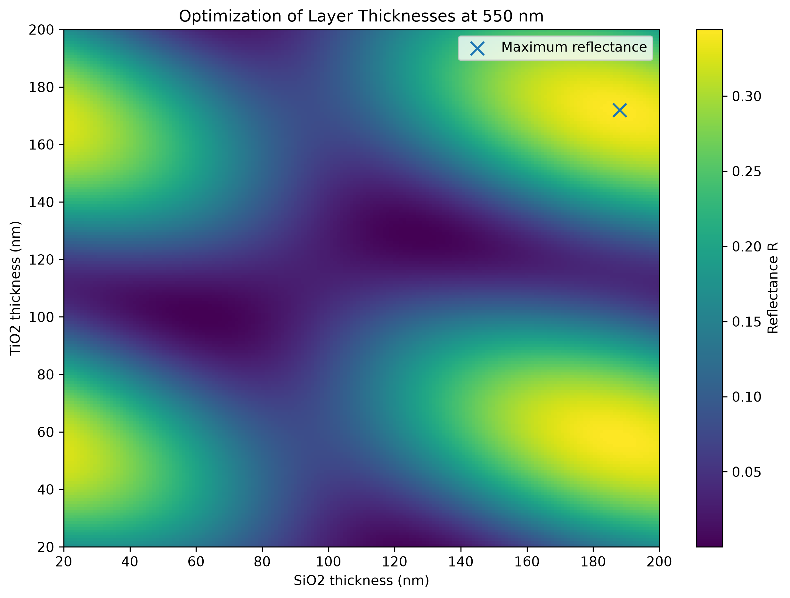

# Multilayer Optics

Python project for numerical simulation of light reflection from interfaces and multilayer optical structures.

The project studies Fresnel reflection, polarization effects, total internal reflection, and multilayer thin-film structures using the Transfer Matrix Method (TMM).

## Project Goals

The main goals of this project are:

- Calculate Fresnel reflection coefficients
- Compare s- and p-polarized light
- Demonstrate Brewster's angle
- Study total internal reflection
- Compare optical materials
- Model multilayer thin-film structures
- Study the influence of layer order and number
- Optimize layer thicknesses for a selected wavelength

## Physics

### Fresnel Reflection

When light reaches an interface between two media, part of the electromagnetic wave is reflected and part is transmitted.

The reflection depends on:

- refractive indices of the materials
- angle of incidence
- polarization of light

For s-polarization:

\[
r_s =
\frac{n_1\cos\theta_1-n_2\cos\theta_2}
{n_1\cos\theta_1+n_2\cos\theta_2}
\]

For p-polarization:

\[
r_p =
\frac{n_2\cos\theta_1-n_1\cos\theta_2}
{n_2\cos\theta_1+n_1\cos\theta_2}
\]

Reflectance is calculated as:

\[
R = |r|^2
\]

### Brewster Angle

For p-polarized light, reflection becomes zero at the Brewster angle:

\[
\theta_B = \arctan\left(\frac{n_2}{n_1}\right)
\]

This effect can be observed in the material comparison simulation.

### Total Internal Reflection

When light travels from a medium with a higher refractive index to a medium with a lower refractive index, total internal reflection can occur.

The critical angle is:

\[
\theta_c =
\arcsin\left(\frac{n_2}{n_1}\right)
\]

For glass-air transition, the simulation gives a critical angle of approximately:

**41.81 degrees**

## Transfer Matrix Method

Multilayer optical structures are modeled using the Transfer Matrix Method (TMM).

Each optical layer is represented by a matrix describing the propagation of an electromagnetic wave through the layer.

By multiplying the matrices of individual layers, the optical response of the complete multilayer structure can be calculated.

This makes it possible to study structures such as:

Air → SiO2 → TiO2 → Glass

and more complex periodic multilayer systems.

## Results

### Fresnel Reflection

The Fresnel simulation demonstrates the dependence of reflectance on the angle of incidence and polarization.



### Material Comparison

Different materials produce different reflection curves because of their different refractive indices.

The simulation compares several optical materials and demonstrates the shift of the Brewster angle.



### Total Internal Reflection

For light traveling from glass to air, reflectance reaches 1 after the critical angle.



### Layer Comparison

The order and number of dielectric layers strongly influence the optical response of the structure.

The simulation compares different SiO2/TiO2 configurations.



### Thickness Optimization

The program scans different SiO2 and TiO2 layer thicknesses and calculates the reflectance at a selected wavelength.

For the current simulation:

- Design wavelength: **550 nm**
- Maximum calculated reflectance: approximately **34.43%**
- Optimal SiO2 thickness: approximately **188 nm**
- Optimal TiO2 thickness: approximately **172 nm**



## Project Structure

```text
multilayer-optics/
│
├── fresnel_reflection.py
├── material_comparison.py
├── total_internal_reflection.py
├── multilayer_tmm.py
├── layer_comparison.py
├── thickness_optimization.py
│
├── figures/
│   ├── fresnel_reflection.png
│   ├── material_comparison.png
│   ├── total_internal_reflection.png
│   ├── layer_comparison.png
│   └── thickness_optimization.png
│
├── requirements.txt
├── README.md
└── .gitignore
```

## Scripts

`fresnel_reflection.py`  
Calculates Fresnel reflection and studies polarization-dependent reflection.

`material_comparison.py`  
Compares Fresnel reflection for materials with different refractive indices.

`total_internal_reflection.py`  
Simulates total internal reflection and calculates the critical angle.

`multilayer_tmm.py`  
Contains the Transfer Matrix Method calculations for multilayer optical structures.

`layer_comparison.py`  
Studies how layer order and number affect reflectance.

`thickness_optimization.py`  
Searches for layer thicknesses that maximize reflectance at the selected wavelength.

## Requirements

The project requires:

- Python 3
- NumPy
- Matplotlib

Install the dependencies with:

```bash
pip install -r requirements.txt
```

## Running the Project

For example:

```bash
python fresnel_reflection.py
```

or:

```bash
python thickness_optimization.py
```

The programs generate plots showing the calculated optical properties.

## Possible Future Development

The project can be extended by adding:

- wavelength-dependent refractive indices
- absorption and complex refractive indices
- arbitrary incidence angles for multilayer structures
- separate s- and p-polarization calculations in TMM
- transmission spectra
- distributed Bragg reflector optimization
- anti-reflection coating design
- comparison with experimental optical data